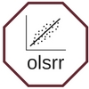

<!-- README.md is generated from README.Rmd. Please edit that file -->

```{r, echo = FALSE}
knitr::opts_chunk$set(
  collapse = TRUE,
  comment = "#>",
  fig.path = "README-"
)
```

# olsrr 

[](https://cran.r-project.org/package=olsrr)
[](https://travis-ci.org/rsquaredacademy/olsrr)
[](https://ci.appveyor.com/project/rsquaredacademy/olsrr)
[](https://codecov.io/github/rsquaredacademy/olsrr?branch=master)

## Overview

R package for OLS regression.

## Installation

You can install olsrr from github with:

```{r gh-installation, eval = FALSE}
# install.packages("devtools")
devtools::install_github("rsquaredacademy/olsrr")
```

## Usage

olsrr provides the following features:

- comprehensive regression output
- 8 model selection methods
- collinearity diagnostics
- detailed residual diagnostics
- post-estimation tests
- influence measures
- information criteria

Please note that this project is released with a [Contributor Code of Conduct](CONDUCT.md). By participating in this project you agree to abide by its terms.
