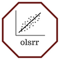

<!-- README.md is generated from README.Rmd. Please edit that file -->
olsrr: Tools for building OLS Regression models 
--------------------------------------------------------------------------------------------------------

**Author:** [Aravind Hebbali](https://www.aravindhebbali.com/)<br/> **License:** [MIT](https://opensource.org/licenses/MIT)

[](https://cran.r-project.org/package=olsrr) [](https://cran.r-project.org/web/checks/check_results_olsrr.html) [](https://travis-ci.org/rsquaredacademy/olsrr) [](https://ci.appveyor.com/project/rsquaredacademy/olsrr) [](https://cran.r-project.org/package=olsrr) [](https://codecov.io/github/rsquaredacademy/olsrr?branch=master) 

### Overview

The olsrr package provides following tools for teaching and learning OLS regression using R:

-   Comprehensive Regression Output
-   Variable Selection Procedures
-   Heteroskedasticity Tests
-   Collinearity Diagnostics
-   Model Fit Assessment
-   Measures of Influence
-   Residual Diagnostics
-   Variable Contribution Assessment

### Installation

You can install olsrr from github with:

``` r
# install olsrr from CRAN
install.packages("olsrr")

# the development version from github
# install.packages("devtools")
devtools::install_github("rsquaredacademy/olsrr")
```

### Shiny App

Use `ols_launch_app()` to explore the package using a shiny app.

### Articles

-   [Quick Overview](https://olsrr.rsquaredacademy.com/articles/intro.html)
-   [Variable Selection Methods](https://olsrr.rsquaredacademy.com/articles/variable_selection.html)
-   [Residual Diagnostics](https://olsrr.rsquaredacademy.com/articles/residual_diagnostics.html)
-   [Heteroskedasticity](https://olsrr.rsquaredacademy.com/articles/heteroskedasticity.html)
-   [Measures of Influence](https://olsrr.rsquaredacademy.com/articles/influence_measures.html)
-   [Collinearity Diagnostics](https://olsrr.rsquaredacademy.com/articles/regression_diagnostics.html)

### Usage

olsrr uses consistent prefix `ols_` for easy tab completion.

olsrr is built with the aim of helping those users who are new to the R language. If you know how to write a `formula` or build models using `lm`, you will find olsrr very useful. Most of the functions use an object of class `lm` as input. So you just need to build a model using `lm` and then pass it onto the functions in olsrr. Below is a quick demo:

##### Regression

``` r
ols_regress(mpg ~ disp + hp + wt + qsec, data = mtcars)
#>                         Model Summary                          
#> --------------------------------------------------------------
#> R                       0.914       RMSE                2.622 
#> R-Squared               0.835       Coef. Var          13.051 
#> Adj. R-Squared          0.811       MSE                 6.875 
#> Pred R-Squared          0.771       MAE                 1.858 
#> --------------------------------------------------------------
#>  RMSE: Root Mean Square Error 
#>  MSE: Mean Square Error 
#>  MAE: Mean Absolute Error 
#> 
#>                                ANOVA                                 
#> --------------------------------------------------------------------
#>                 Sum of                                              
#>                Squares        DF    Mean Square      F         Sig. 
#> --------------------------------------------------------------------
#> Regression     940.412         4        235.103    34.195    0.0000 
#> Residual       185.635        27          6.875                     
#> Total         1126.047        31                                    
#> --------------------------------------------------------------------
#> 
#>                                   Parameter Estimates                                    
#> ----------------------------------------------------------------------------------------
#>       model      Beta    Std. Error    Std. Beta      t        Sig      lower     upper 
#> ----------------------------------------------------------------------------------------
#> (Intercept)    27.330         8.639                  3.164    0.004     9.604    45.055 
#>        disp     0.003         0.011        0.055     0.248    0.806    -0.019     0.025 
#>          hp    -0.019         0.016       -0.212    -1.196    0.242    -0.051     0.013 
#>          wt    -4.609         1.266       -0.748    -3.641    0.001    -7.206    -2.012 
#>        qsec     0.544         0.466        0.161     1.166    0.254    -0.413     1.501 
#> ----------------------------------------------------------------------------------------
```

##### Stepwise Regression

Build regression model from a set of candidate predictor variables by entering and removing predictors based on p values, in a stepwise manner until there is no variable left to enter or remove any more.

###### Variable Selection

``` r
# stepwise regression
model <- lm(y ~ ., data = surgical)
ols_step_both_p(model)
#> Stepwise Selection Method   
#> ---------------------------
#> 
#> Candidate Terms: 
#> 
#> 1. bcs 
#> 2. pindex 
#> 3. enzyme_test 
#> 4. liver_test 
#> 5. age 
#> 6. gender 
#> 7. alc_mod 
#> 8. alc_heavy 
#> 
#> We are selecting variables based on p value...
#> 
#> Variables Entered/Removed: 
#> 
#> - liver_test added 
#> - alc_heavy added 
#> - enzyme_test added 
#> - pindex added 
#> - bcs added 
#> 
#> No more variables to be added/removed.
#> 
#> 
#> Final Model Output 
#> ------------------
#> 
#>                           Model Summary                           
#> -----------------------------------------------------------------
#> R                       0.884       RMSE                 195.454 
#> R-Squared               0.781       Coef. Var             27.839 
#> Adj. R-Squared          0.758       MSE                38202.426 
#> Pred R-Squared          0.700       MAE                  137.656 
#> -----------------------------------------------------------------
#>  RMSE: Root Mean Square Error 
#>  MSE: Mean Square Error 
#>  MAE: Mean Absolute Error 
#> 
#>                                  ANOVA                                  
#> -----------------------------------------------------------------------
#>                    Sum of                                              
#>                   Squares        DF    Mean Square      F         Sig. 
#> -----------------------------------------------------------------------
#> Regression    6535804.090         5    1307160.818    34.217    0.0000 
#> Residual      1833716.447        48      38202.426                     
#> Total         8369520.537        53                                    
#> -----------------------------------------------------------------------
#> 
#>                                       Parameter Estimates                                        
#> ------------------------------------------------------------------------------------------------
#>       model         Beta    Std. Error    Std. Beta      t        Sig         lower       upper 
#> ------------------------------------------------------------------------------------------------
#> (Intercept)    -1178.330       208.682                 -5.647    0.000    -1597.914    -758.746 
#>  liver_test       58.064        40.144        0.156     1.446    0.155      -22.652     138.779 
#>   alc_heavy      317.848        71.634        0.314     4.437    0.000      173.818     461.878 
#> enzyme_test        9.748         1.656        0.521     5.887    0.000        6.419      13.077 
#>      pindex        8.924         1.808        0.380     4.935    0.000        5.288      12.559 
#>         bcs       59.864        23.060        0.241     2.596    0.012       13.498     106.230 
#> ------------------------------------------------------------------------------------------------
#> 
#>                                 Stepwise Selection Summary                                 
#> ------------------------------------------------------------------------------------------
#>                         Added/                   Adj.                                         
#> Step     Variable      Removed     R-Square    R-Square     C(p)        AIC         RMSE      
#> ------------------------------------------------------------------------------------------
#>    1    liver_test     addition       0.455       0.444    62.5120    771.8753    296.2992    
#>    2     alc_heavy     addition       0.567       0.550    41.3680    761.4394    266.6484    
#>    3    enzyme_test    addition       0.659       0.639    24.3380    750.5089    238.9145    
#>    4      pindex       addition       0.750       0.730     7.5370    735.7146    206.5835    
#>    5        bcs        addition       0.781       0.758     3.1920    730.6204    195.4544    
#> ------------------------------------------------------------------------------------------
```

##### Stepwise AIC Backward Regression

Build regression model from a set of candidate predictor variables by removing predictors based on Akaike Information Criteria, in a stepwise manner until there is no variable left to remove any more.

###### Variable Selection

``` r
# stepwise aic backward regression
model <- lm(y ~ ., data = surgical)
k <- ols_step_backward_aic(model)
#> Backward Elimination Method 
#> ---------------------------
#> 
#> Candidate Terms: 
#> 
#> 1 . bcs 
#> 2 . pindex 
#> 3 . enzyme_test 
#> 4 . liver_test 
#> 5 . age 
#> 6 . gender 
#> 7 . alc_mod 
#> 8 . alc_heavy 
#> 
#> 
#> Variables Removed: 
#> 
#> - alc_mod 
#> - gender 
#> - age 
#> 
#> No more variables to be removed.
k
#> 
#> 
#>                         Backward Elimination Summary                         
#> ---------------------------------------------------------------------------
#> Variable        AIC          RSS          Sum Sq        R-Sq      Adj. R-Sq 
#> ---------------------------------------------------------------------------
#> Full Model    736.390    1825905.713    6543614.824    0.78184      0.74305 
#> alc_mod       734.407    1826477.828    6543042.709    0.78177      0.74856 
#> gender        732.494    1829435.617    6540084.920    0.78142      0.75351 
#> age           730.620    1833716.447    6535804.090    0.78091      0.75808 
#> ---------------------------------------------------------------------------
```

##### Breusch Pagan Test

Breusch Pagan test is used to test for herteroskedasticity (non-constant error variance). It tests whether the variance of the errors from a regression is dependent on the values of the independent variables. It is a *χ*<sup>2</sup> test.

``` r
model <- lm(mpg ~ disp + hp + wt + drat, data = mtcars)
ols_test_breusch_pagan(model)
#> 
#>  Breusch Pagan Test for Heteroskedasticity
#>  -----------------------------------------
#>  Ho: the variance is constant            
#>  Ha: the variance is not constant        
#> 
#>              Data               
#>  -------------------------------
#>  Response : mpg 
#>  Variables: fitted values of mpg 
#> 
#>        Test Summary         
#>  ---------------------------
#>  DF            =    1 
#>  Chi2          =    1.429672 
#>  Prob > Chi2   =    0.231818
```

##### Collinearity Diagnostics

``` r
model <- lm(mpg ~ disp + hp + wt + qsec, data = mtcars)
ols_coll_diag(model)
#> Tolerance and Variance Inflation Factor
#> ---------------------------------------
#> # A tibble: 4 x 3
#>   Variables Tolerance   VIF
#>   <chr>         <dbl> <dbl>
#> 1 disp          0.125  7.99
#> 2 hp            0.194  5.17
#> 3 wt            0.145  6.92
#> 4 qsec          0.319  3.13
#> 
#> 
#> Eigenvalue and Condition Index
#> ------------------------------
#>    Eigenvalue Condition Index   intercept        disp          hp
#> 1 4.721487187        1.000000 0.000123237 0.001132468 0.001413094
#> 2 0.216562203        4.669260 0.002617424 0.036811051 0.027751289
#> 3 0.050416837        9.677242 0.001656551 0.120881424 0.392366164
#> 4 0.010104757       21.616057 0.025805998 0.777260487 0.059594623
#> 5 0.001429017       57.480524 0.969796790 0.063914571 0.518874831
#>             wt         qsec
#> 1 0.0005253393 0.0001277169
#> 2 0.0002096014 0.0046789491
#> 3 0.0377028008 0.0001952599
#> 4 0.7017528428 0.0024577686
#> 5 0.2598094157 0.9925403056
```

### Getting Help

If you encounter a bug, please file a minimal reproducible example using [reprex](https://reprex.tidyverse.org/index.html) on github. For questions and clarifications, use [StackOverflow](https://stackoverflow.com/).

### Code of Conduct

Please note that this project is released with a [Contributor Code of Conduct](CONDUCT.md). By participating in this project you agree to abide by its terms.
